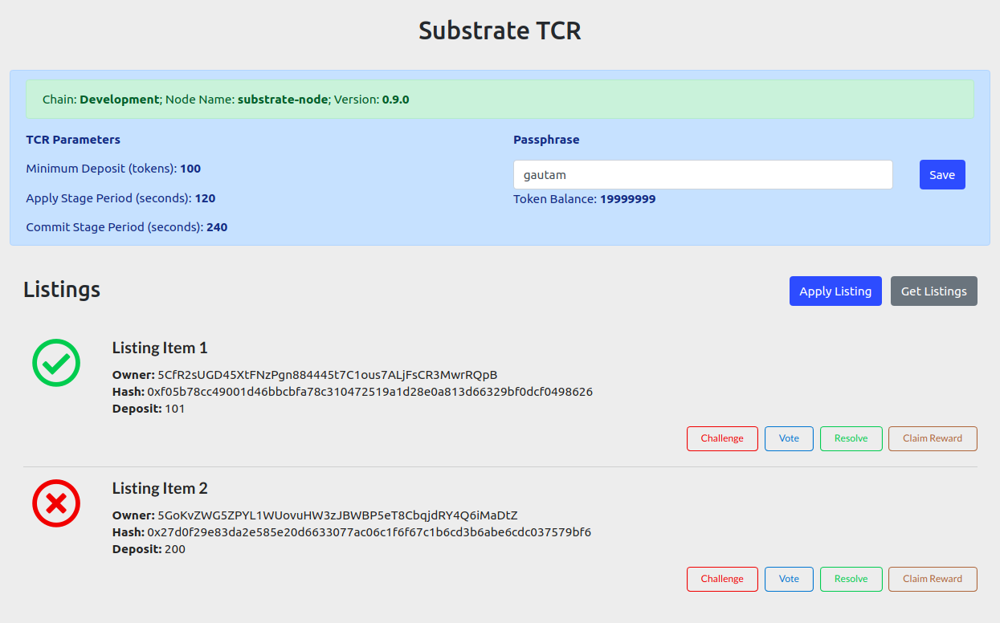

# Substrate TCR UI

Simple frontend for the [substrate TCR](https://github.com/gautamdhameja/substrate-tcr) runtime. This is a react.js app, bootstrapped with [Create React App](https://github.com/facebook/create-react-app).

This app interacts with the Substrate TCR runtime using the [Polkadot JS API](https://github.com/polkadot-js/api) javascript client library.

## Usage

1. Run a local Substrate node with [Substrate-TCR](https://github.com/gautamdhameja/substrate-tcr) runtime.
1. Clone this repo.
1. Run `npm install` inside the directory where you have cloned this repo.
1. Run `npm start`. The app should automatically connect to the local Substrate node.